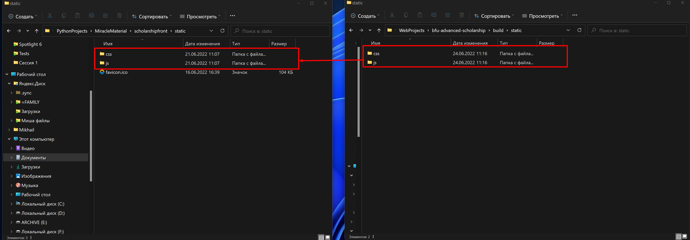
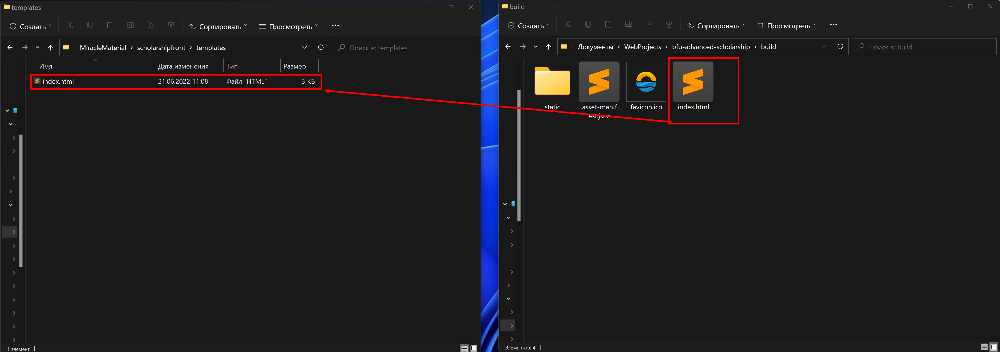
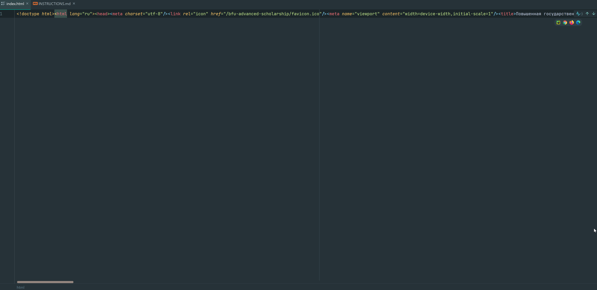
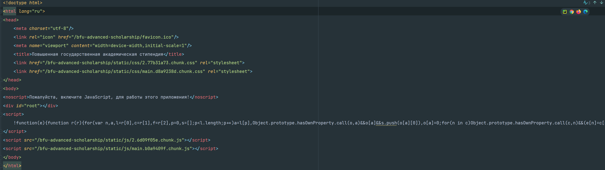
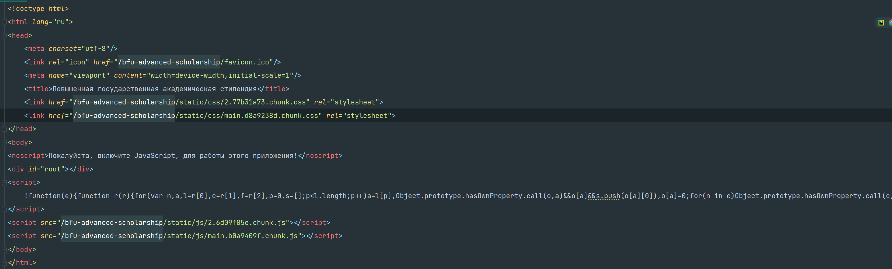
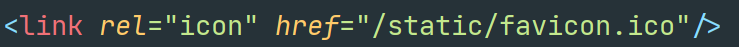
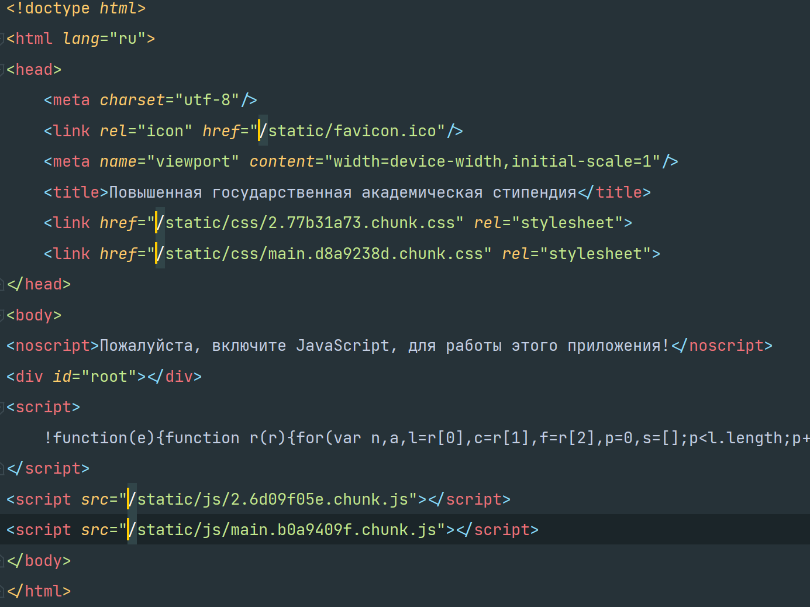
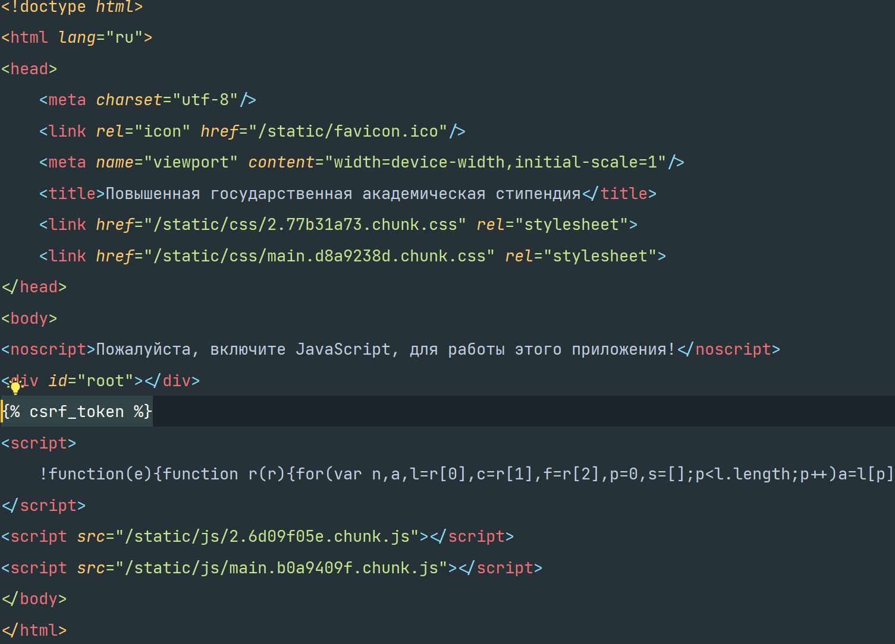

# BFU Advanced Scholarship

Повышенная государственная академическая стипендия

## Запуск сервера разработки

```shell
npm start
```

Сайт откроется по адресу [http://localhost:3000](http://localhost:3000) и будет автоматически обновляться при любом изменении кода

## Сборка сайта на production

```shell
npm run build
```

Система автоматически скомпилирует файлы в папке _build_.

Для того чтобы корректно перенести файлы в django приложение, нужно:
* заменить папки _css_ и _js_ в директории _scholarshipfront/static_ на папки _css_ и _js_ в директории _build/static_

* заменить файл в _scholarshipfront/templates/index.html_ на _build/index.html_

* Открыть файл _scholarshipfront/templates/index.html_ в Pycharm

* Отформатировать файл, нажав `Ctrl+Alt+L`

* Удалить префиксы `/bfu-advanced-scholarship` у тегов _link_ и _script_

* Добавить префикс `/static` для атрибута _href_ у первого тега _link_

* Проверить чтобы у тегов _link_ и _script_ атрибуты _src_ или _href_ начинались с `/`\

* ОЧЕНЬ ВАЖНО, поставить jinja тега ``


Можно заливать в production